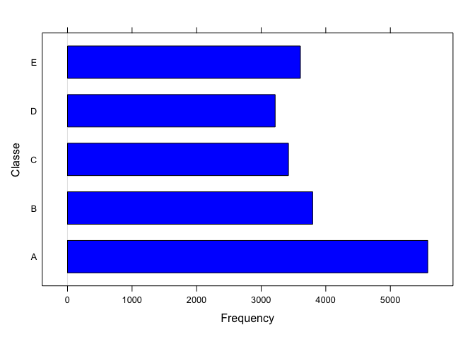

## Background
Using devices such as Jawbone Up, Nike FuelBand, and Fitbit it is now possible to collect a large amount of data about personal activity relatively inexpensively. These type of devices are part of the quantified self movement – a group of enthusiasts who take measurements about themselves regularly to improve their health, to find patterns in their behavior, or because they are tech geeks. One thing that people regularly do is quantify how much of a particular activity they do, but they rarely quantify how well they do it. In this project, your goal will be to use data from accelerometers on the belt, forearm, arm, and dumbell of 6 participants. They were asked to perform barbell lifts correctly and incorrectly in 5 different ways. More information is available from the website [here](http://groupware.les.inf.puc-rio.br/har). 

## Data 
The training data for this project are available here: 

* <https://d396qusza40orc.cloudfront.net/predmachlearn/pml-training.csv>

The test data are available here:

* <https://d396qusza40orc.cloudfront.net/predmachlearn/pml-testing.csv>

The data for this project come from [this source](http://groupware.les.inf.puc-rio.br/har). If you use the document you create for this class for any purpose please cite them as they have been very generous in allowing their data to be used for this kind of assignment. 

# Data Preparation

Let us upload the packages that we shall be using in the sequel.

```r
library(ggplot2)
library(caret)
```

```
## Loading required package: lattice
```

The first thing to do is to download the data into the local directory.

```r
# Files url:
trainUrl <- "https://d396qusza40orc.cloudfront.net/predmachlearn/pml-training.csv"
testUrl <- "https://d396qusza40orc.cloudfront.net/predmachlearn/pml-testing.csv"

# Downloading files
download.file(trainUrl, destfile = "./pml-training.csv", method = "curl")
download.file(testUrl, destfile = "./pml-testing.csv", method = "curl")
rm(trainUrl, testUrl)
```

Now we can upload the data into R.

```r
training <- read.csv("./pml-training.csv", na.strings = c("NA", "", "#DIV/0!"))
testing <- read.csv("./pml-testing.csv", na.strings = c("NA", "", "#DIV/0!"))
```

## Data Exploration

Let us see the dimension of the training set and the distribution of the variable `classe`, which is the one we wish to predict. It is also useful to see a bar chart of this variable.

```r
dim(training)
```

```
## [1] 19622   160
```

```r
dim(testing)
```

```
## [1]  20 160
```

```r
table(training$classe)
```

```
## 
##    A    B    C    D    E 
## 5580 3797 3422 3216 3607
```

```r
barchart(training$classe, xlab = "Frequency", ylab = "Classe", col = "blue")
```

<!-- -->


Let us also transform this variable into a factor.

```r
training$classe <- factor(training$classe)
```

Let us check the number of missing values in the data set.

```r
nrow(training[!complete.cases(training),])
```

```
## [1] 19622
```
It looks like all rows in the data set have missing values. Let us see if there are specific variables where these missing values are.

```r
ncol(training[,!complete.cases(t(training))])
```

```
## [1] 100
```
It seems reasonable to omit the variables with missing values, and only focus on those with no missing values.

```r
NA_list <- !complete.cases(t(training))
training <- training[,!NA_list]
testing <- testing[,!NA_list]
rm(NA_list)
```

Let us also remove some columns that are not interesting for the prediction problem, which correspond to the first seven columns. Let us also remove the column labelled `id_problem` from the testing set.

```r
training <- training[,-(1:7)]
testing <- testing[,-(1:7)]
testing <- testing[,-ncol(testing)]
```


## Creating a validation set

Once the data is processed, we wish to extract from the training set a subset to validate the model. Let us take the 60% of the set for the training and the 40% for the validation.

```r
set.seed(101001)
inTrain <- createDataPartition(y = training$classe, p = 0.60, list = FALSE)
train <- training[inTrain,]
valid <- training[-inTrain,]
```

## Prediction Model

This is a classification problem, so it looks natural to use a classification method. We proceed with training the model using the **random forest** algorithm with a 3-fold cross validation.


```r
control <- trainControl(method = "cv", number = 4)
model <- train(classe ~ . , data = train, 
               method = "rf", trControl = control)
print(model)
```

```
## Random Forest 
## 
## 11776 samples
##    52 predictor
##     5 classes: 'A', 'B', 'C', 'D', 'E' 
## 
## No pre-processing
## Resampling: Cross-Validated (4 fold) 
## Summary of sample sizes: 8832, 8831, 8833, 8832 
## Resampling results across tuning parameters:
## 
##   mtry  Accuracy   Kappa    
##    2    0.9864982  0.9829187
##   27    0.9889609  0.9860355
##   52    0.9824227  0.9777601
## 
## Accuracy was used to select the optimal model using the largest value.
## The final value used for the model was mtry = 27.
```

## Validation

Now we evaluate the model with the confusion matrix:


```r
valid_predict <- predict(model, newdata = valid)
table(valid_predict)
```

```
## valid_predict
##    A    B    C    D    E 
## 2243 1506 1383 1281 1433
```

```r
table(valid$classe)
```

```
## 
##    A    B    C    D    E 
## 2232 1518 1368 1286 1442
```

```r
confusionMatrix(valid$classe, valid_predict)
```

```
## Confusion Matrix and Statistics
## 
##           Reference
## Prediction    A    B    C    D    E
##          A 2229    0    3    0    0
##          B   14 1497    6    1    0
##          C    0    8 1350   10    0
##          D    0    0   19 1267    0
##          E    0    1    5    3 1433
## 
## Overall Statistics
##                                          
##                Accuracy : 0.9911         
##                  95% CI : (0.9887, 0.993)
##     No Information Rate : 0.2859         
##     P-Value [Acc > NIR] : < 2.2e-16      
##                                          
##                   Kappa : 0.9887         
##                                          
##  Mcnemar's Test P-Value : NA             
## 
## Statistics by Class:
## 
##                      Class: A Class: B Class: C Class: D Class: E
## Sensitivity            0.9938   0.9940   0.9761   0.9891   1.0000
## Specificity            0.9995   0.9967   0.9972   0.9971   0.9986
## Pos Pred Value         0.9987   0.9862   0.9868   0.9852   0.9938
## Neg Pred Value         0.9975   0.9986   0.9949   0.9979   1.0000
## Prevalence             0.2859   0.1919   0.1763   0.1633   0.1826
## Detection Rate         0.2841   0.1908   0.1721   0.1615   0.1826
## Detection Prevalence   0.2845   0.1935   0.1744   0.1639   0.1838
## Balanced Accuracy      0.9966   0.9954   0.9867   0.9931   0.9993
```

# Testing the model

Finally, we proceed with predicting the new values for the testing set provided.

```r
prediction <- predict(model, newdata = testing)
print(prediction)
```

```
##  [1] B A B A A E D B A A B C B A E E A B B B
## Levels: A B C D E
```

Let us also see a table of predictions

```r
table(prediction)
```

```
## prediction
## A B C D E 
## 7 8 1 1 3
```


